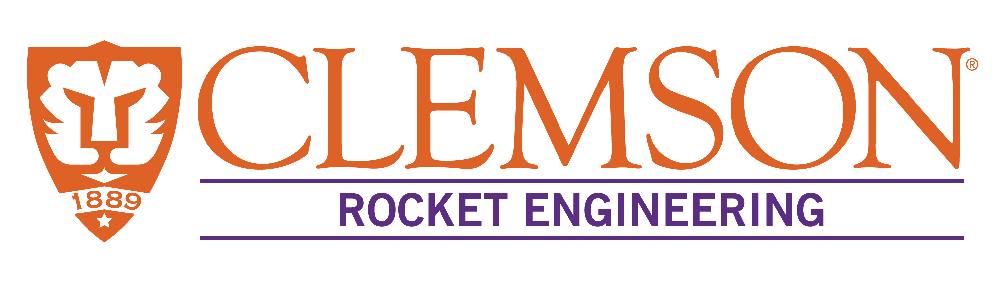

### About
This is the repository containing the Clemson University Rocket Engineering (CURE) Avionics 
subteam. Powers CURE's non-competitive rockets and rockets that participate in the annual
Intercollegiate Rocket Engineering Competition. Begun by Foster McLane in 2016.

### How To

### TODO
