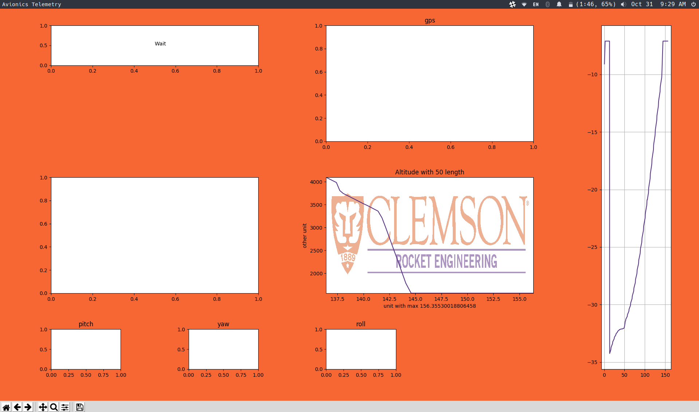

# Base Telemetry
### TODO
* Write `graph/` functions
  * speedometer
  * pitch, yaw, roll
* `mpl.py` aesthetic
* Where is command located in main?
* Command integration in mpl
* Camera?

### Running
#### Compiling and Running
1. `python2 main.py` for main telemetry
2. `python3 mpl.py` for visual data
   * Requires `main.py` to be running
   
#### Debugging
* To debug and test `mpl.py`
  1. Run `python3 mpl_simulator.py`
  2. Also run `python3 mpl.py` while the other is running
  3. Look at graphs and adjust program
  4. Remove `quickbox.json` when complete, or don't, just don't push it
* To debug and test `main.py`
  1. Pray to the gods that it works
  2. TODO

### Information
* JSON Formatting
  * example: `{"sensors":{"gyro":{"x":0,"y":0,"z":0},"acc":{"x":0.000025,"y":0.000025,"z":38.01759},"mag":{"x":0,"y":0,"z":0},"att":{"r":6.451225e-7,"p":-6.451225e-7,"y":-0.108385},"bar":{"p":101324.9,"dp":0.890625,"alt":0.001904,"gnd":1237.593,"temp":0,"hum":0},"gps":{"lat":0,"lon":0,"hour":0,"min":0,"sec":0,"day":0,"mon":0,"year":0}},"type":"telemetry","time":804}`
  * Rocket will return self-contained json
    * Will always contain `type`, `time`, and `state`
      * `type` will be 1 of: state, telemetry, 
      * `time` is in units of (ms?)...
      * `state` will be 1 of the states: ignite, burn, apogee, wait, eject, fall, recover
    * Telemetry contains ... TODO

### Components
#### Current Components
* Communications Antenna
  * ???
