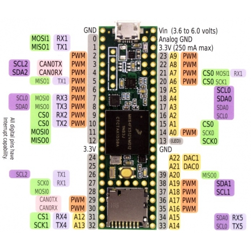

# On-board avionics

### Making
#### Compiling and Running
1. `make ?` to compile and run
#### Debugging
1. Debug todo

### Components
#### Current Components
* General Hardware
  * Teensy 3.5 Arduino
  * 
* Sensors
  1. 9DOF - 3D gyroscope, magnetometer, and accelerometer
     * [sparkfun link](https://www.sparkfun.com/products/13944)
       * schematic and eagle files provided
     * I2C interface
  2. BME280 - altitude, pressure, and temperature
     * [sparkfun link](https://www.sparkfun.com/products/13676)
       * schematic and eagle files provided
     * 3.3V SPI interface and 5V tolerant I2C
     * 10 pins, < 6 used
  3. GPS - What gps did we use?? Are we still using it???
#### Past Components

### Order of Operations
* Setup():main.ino
  1. debug_init():debug.cpp
  2. ninedof_init():ninedof.cpp
     * .settings.device.commInterface: LSM9DS1
     * .settings.device.mAddress: LSM9DS1
     * .settings.device.agAddress: LSM9DS1
     * .begin(): LSM9DS1
  3. barometer_init():barometer.cpp
     * .settings.commInterface: BME280
     * .settings.I2CAddress: BME280
     * .settings.runMode: BME280
     * .settings.tStandby: BME280
     * .settings.filter: BME280
     * .settings.tempOverSample: BME280
     * .settings.pressOverSample: BME280
     * .settings.humidOverSample: BME280
     * .begin(): BME280
  4. gps_init():gps.cpp
  5. datalog_init():datalog.cpp
  6. communication_init():communication.cpp
  7. state_init():state.cpp
     * EEPROM functions
  8. Sensor Setup
     * set up JSON tables
     * Serial2.begin()
* Loop():main.ino
  * state_loop():state.cpp
    1. init
       * state = IDLE
    2. idle():state.cpp
       * communication_sendState(IDLE): communication.cpp
       * communication_recvCommand(): communication.cpp
       * debug_write(): debug.cpp
    3. halt():state.cpp
       * debug_write():debug.cpp
       * state = IDLE
    4. test():state.cpp
       * communication_sendState():communication.cpp
         * msg_state.printTo(serial2)
         * datalog_write():datalog.cpp
           * Write to SD card
       * communication_updateTelemetry():communication.cpp
         * ninedof_read():ninedof.cpp
           * ?
         * barometer_read():barometer.cpp
           * Uses libary bme280.cpp
           * sim_getBarometer():?
           * Set barometer data
         * gps_read():gps.cpp
           * ?
         * sim_updateTelemetry:?
         * datalog_write():datalog.cpp
           * Write to SD card
       * communication_sendResult():communication.cpp
         * datalog_write():datalog.cpp
           * Write to SD card
       * debug_write:debug.cpp
         * digital_write()
       * state = IDLE
    5. arm():state.cpp
       * communication_sendState(ARM): communication.cpp
       * communication_updateTelemetry(): communication.cpp
       * communication_recvCommand(): communication.cpp
       * change state on command
    6. ignite():state.cpp
       * communication_sendState(IGNITE): communication.cpp
       * sim_start = millis()
       * EEPROPM.put(): 
       * communication_updateTelemetry(): communication.cpp
       * state = BURN
    7. burn():state.cpp
       * communication_sendState(BURN): communication.cpp
       * communication_updateTelemetry(): communication.cpp
       * state = COAST
    8. coast():state.cpp
       * communication_sendState(COAST): communication.cpp
       * communication_updateTelemetry(): communication.cpp
       * state = APOGEE
    9. apogee():state.cpp
       * communication_sendState(APOGEE): communication.cpp
       * wait for ejection delay, send parachute signal
       * communication_recvCommand(): communication.cpp
       * communication_updateTelemetry(): communication.cpp
       * state = WAIT
    10. wait():state.cpp
        * communicaiton_sendState(WAIT): communication.cpp
        * communication_updateTelemetry(): communication.cpp
        * state = EJECT
    11. eject():state.cpp
        * communication_sendState(EJECT): communication.cpp
        * wait for ejection delay, send parachute signal
        * state = FALL
    12. fall():state.cpp
        * communication_sendState(FALL): communication.cpp
        * communication_updateTelemetry(): communication.cpp
        * state = RECOVER
    13. recover():state.cpp
        * communication_sendState(RECOVER): communication.cpp
        * state = IDLE
    * EEPROM.put()
      * If state change

### Questions for Foster
1. How do we make/run the program?  
2. How do we debug the program?  
main.ino  
    71: why byte? a: less memory than int  
    74-96: why +=?  
ninedof.cpp  
    25: ifndefs for SIM? In almost all _read() function  
what does util.h do?  
